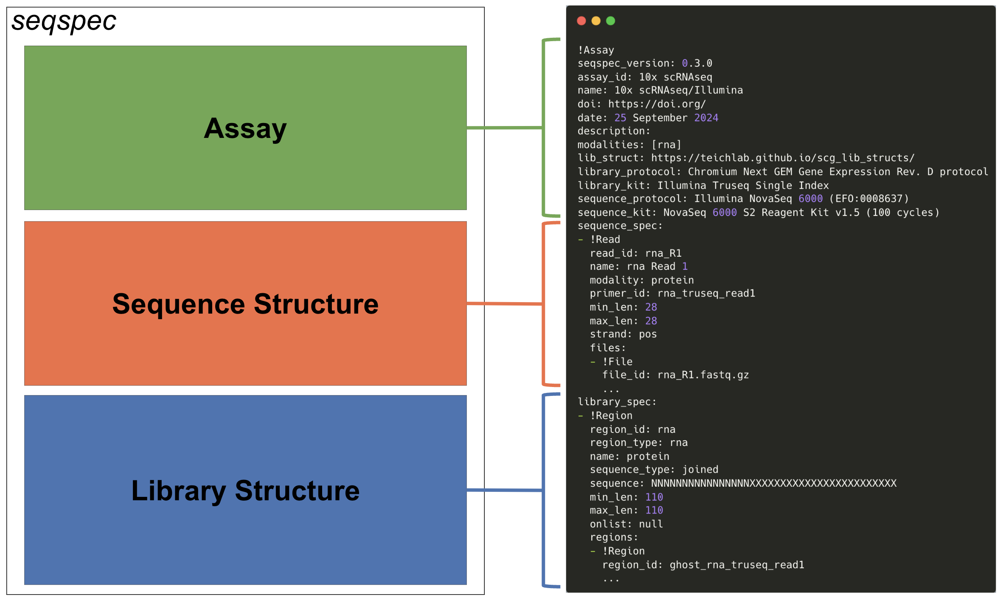

# seqspec


[](https://pypi.org/project/seqspec/0.4.0/)

[](LICENSE)

`seqspec`, short for "sequence specification" (pronounced "seek-speck"), is a file format that describes data generated from genomics experiments. Both the file format and `seqspec` tool [enable uniform processing](./docs/UNIFORM.md) of genomics data.


**Figure 1**: Anatomy of a `seqspec` file.

We have multiple tutorials to get you up and running with `seqspec`:

1. Learn how to use `seqspec` to [standardize your genomics data preprocessing](docs/UNIFORM.ipynb).

2. Understand how to [manipulate `seqspec` files](docs/USING_SEQSPEC.ipynb) using the `seqspec` command-line tool.

## Citation

The `seqspec` format and tool are described in this [publication](https://doi.org/10.1093/bioinformatics/btae168). If you use `seqspec` please cite

```
Ali Sina Booeshaghi, Xi Chen, Lior Pachter, A machine-readable specification for genomics assays, Bioinformatics, Volume 40, Issue 4, April 2024, btae168.
```

`seqspec` was inspired by and builds off of the Teichmann Lab [Single Cell Genomics Library Structure](https://github.com/Teichlab/scg_lib_structs) by [Xi Chen](https://github.com/dbrg77).

## Documentation

- [Install `seqspec`: `docs/INSTALLATION.md`](docs/INSTALLATION.md)
- [Learn about the `seqspec` file format: `docs/DOCUMENTATION.md`](docs/SEQSPEC_FILE.md)
- [Learn about the `seqspec` tool: `docs/DOCUMENTATION.md`](docs/SEQSPEC_TOOL.md)
- [Learn about the `seqspec` specification : `docs/SPECIFICATION.md`](docs/SPECIFICATION.md)
- [Write a `seqspec`: `docs/TUTORIAL.md`](docs/TUTORIAL.md)
- [View example `seqspec` files: `https://www.sina.bio/seqspec-builder/assays.html`](https://www.sina.bio/seqspec-builder/assays.html)
- [Contribute a `seqspec` : `docs/CONTRIBUTING.md`](docs/CONTRIBUTING.md)
- [Watch a YouTube video about `seqspec`](https://youtu.be/NSj6Vpzy8tU)
- [Read the manuscript that describes `seqspec`](https://doi.org/10.1093/bioinformatics/btae168)
