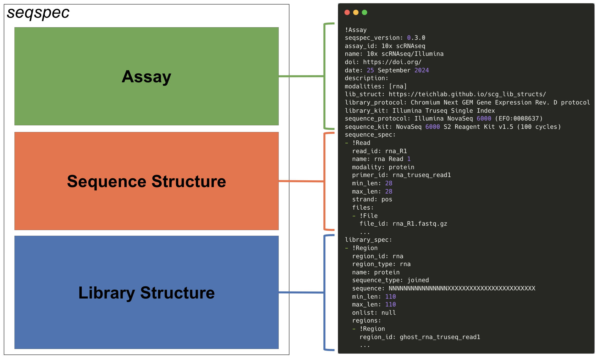

# seqspec


[](https://pypi.org/project/seqspec/0.4.0/)

[](LICENSE)

`seqspec`, short for "sequence specification" (pronounced "seek-speck"), is a file format that describes data generated from genomics experiments. Both the file format and `seqspec` tool [enable uniform processing](./docs/UNIFORM.md) of genomics data.


**Figure 1**: Anatomy of a `seqspec` file.

We have multiple tutorials to get you up and running with `seqspec`:

1. Learn how to use `seqspec` to [standardize your genomics data preprocessing](docs/UNIFORM.ipynb).

2. Understand how to [manipulate `seqspec` files](docs/USING_SEQSPEC.ipynb) using the `seqspec` command-line tool.

## Current release

`seqspec 0.4.0` keeps the Python and Rust implementations aligned around the same core command set.

- `seqspec upgrade` upgrades `0.3.0` specs to `0.4.0` in both implementations.
- `seqspec` loads gzipped specs directly, so `.yaml.gz` works anywhere a spec path is accepted.
- `seqspec auth` manages host-matched auth profiles for remote resources, and `seqspec check` / `seqspec onlist` can use them with `--auth-profile`.
- `seqspec onlist -s region-type` now errors when the same region type appears across multiple reads, so ambiguous joins are explicit.
- `seqspec print -f seqspec-html` writes a self-contained HTML view of the library and reads.
- `seqspec build` is deprecated.

## Citation

The `seqspec` format and tool are described in this [publication](https://doi.org/10.1093/bioinformatics/btae168). If you use `seqspec` please cite

```
Ali Sina Booeshaghi, Xi Chen, Lior Pachter, A machine-readable specification for genomics assays, Bioinformatics, Volume 40, Issue 4, April 2024, btae168.
```

`seqspec` was inspired by and builds off of the Teichmann Lab [Single Cell Genomics Library Structure](https://github.com/Teichlab/scg_lib_structs) by [Xi Chen](https://github.com/dbrg77).

## Documentation

- [Install `seqspec`: `docs/INSTALLATION.md`](docs/INSTALLATION.md)
- [Learn about the `seqspec` file format: `docs/SEQSPEC_FILE.md`](docs/SEQSPEC_FILE.md)
- [Learn about the `seqspec` tool: `docs/SEQSPEC_TOOL.md`](docs/SEQSPEC_TOOL.md)
- [Learn about the `seqspec` specification: `docs/SPECIFICATION.md`](docs/SPECIFICATION.md)
- [Write a `seqspec` from a simple example: `docs/TUTORIAL_SIMPLE.md`](docs/TUTORIAL_SIMPLE.md)
- [Write a `seqspec` from a template: `docs/TUTORIAL_FROM_TEMPLATE.md`](docs/TUTORIAL_FROM_TEMPLATE.md)
- [Write a more complex `seqspec`: `docs/TUTORIAL_COMPLEX.md`](docs/TUTORIAL_COMPLEX.md)
- [View example `seqspec` files: `https://www.sina.bio/seqspec-builder/assays.html`](https://www.sina.bio/seqspec-builder/assays.html)
- [Contribute a `seqspec` : `docs/CONTRIBUTING.md`](docs/CONTRIBUTING.md)
- [Watch a YouTube video about `seqspec`](https://youtu.be/NSj6Vpzy8tU)
- [Read the manuscript that describes `seqspec`](https://doi.org/10.1093/bioinformatics/btae168)

## Rust implementation

- [x] auth : Manage remote authentication profiles.
- build : Deprecated in both CLIs.
- [x] check : Validate seqspec file against specification (verify check)
- [x] find : Find objects in seqspec file
- [x] file : List files present in seqspec file
- [x] format : Autoformat seqspec file
- [x] index : Identify position of elements in seqspec file
- [x] info : Get information from seqspec file
- [x] init : Generate a new empty seqspec file
- [x] insert : Insert regions or reads into an existing spec (TODO: move Input structs to models)
- [x] methods : Convert seqspec file into methods section
- [x] modify : Modify attributes of various elements in seqspec file
- [x] onlist : Get onlist file for elements in seqspec file
- [x] print : Display the sequence and/or library structure from seqspec file
- [x] split : Split seqspec file by modality
- [x] upgrade : Upgrade seqspec file to current version
- [x] version: Get seqspec tool version and seqspec file version

The standalone Rust CLI supports `library-ascii`, `seqspec-ascii`, and `seqspec-html` in `seqspec print`. `seqspec-png` remains Python-only for now.
