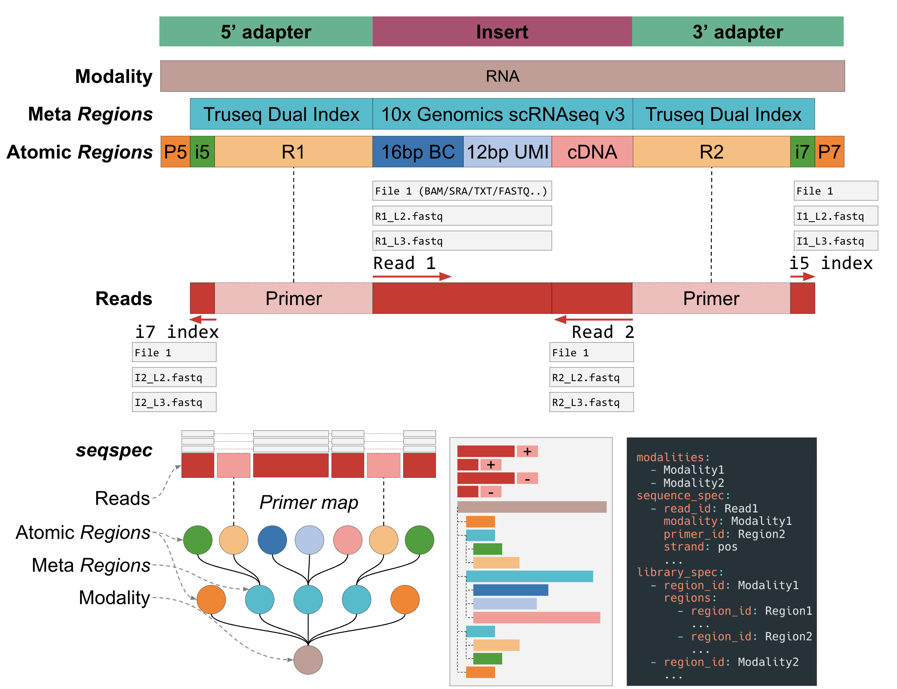

# Overview

`seqspec` is a machine-readable specification for annotating sequencing libraries produced by genomics assays. Genomic library structure depends on both the assay and sequencer (and kits) used to generate and bind the assay-specific construct to the sequencing adapters to generate a sequencing library. `seqspec` is specific to both a genomics assay and sequencer and provides a standardized format for describing the structure of sequencing libraries and the resulting sequencing reads. Specifically, a `seqspec` file is a machine-readable YAML file that annotates the content of molecules in genomic libraries, the structure of reads generated from them, and how those are stored in files.

The primary goal of a `seqspec` file is to:

1. Facilitate standardization of preprocessing steps across different assays
2. Enable data management and tracking
3. Simplify the interpretation and reuse of sequencing data


**Figure 1**: Detailed structure of a `seqspec` file.

A `seqspec` file, **Figure 1**, contains

1. Assay-level metadata such as library kit and sequencing machine,
2. The 5'->3' annotation and position of the elements in a library molecule (e.g. barcodes, UMIs),
3. A list of the reads generated from sequencing the library molecule.

# Structure

A seqspec file consists of three main components:

1. **Assay Information**: Metadata about the assay, including identifiers, protocols, and kits used.
2. **Library Structure**: Description of the molecular components in the sequencing library.
3. **Read Structure**: Description of the sequencing reads generated from the sequencing library.

seqspec files are written in YAML format and can be created and edited in a text editor like VSCode, TextEdit, Notepad, or Sublime. The basic structure includes:

```yaml
seqspec_version: <version>
assay_id:
# + Assay metadata
modalities:
  # List of modalities (e.g., RNA, DNA, ATAC)
library_spec:
  # List of regions in the library
sequence_spec:
  # List of reads generated from the library
```

`seqspec` files can be manipulated and used with the `seqspec` command line tool.

## Assay Information

The header of a `seqspec` file stores assay metadata including library preparation and sequencing kits and protocols.

`modalities` contains a list of strings describing the types of molecules assayed. They come from a [controlled vocabulary](SPECIFICATION.md).

## Library structure

The `library_spec` describes the "regions", or set of standard "blocks" such as a barcode, contained in the sequencing library. Each region is annotated with the following metadata:

- `region_id`: Unique identifier for the region
- `region_type`: Type of region (e.g., barcode, UMI, cDNA)
- `sequence_type`: Nature of the sequence (fixed, random, onlist)
- `sequence`: Actual or representative sequence
- `min_len` and `max_len`: Minimum and maximum length of the region

Each region can contain nested regions under the `regions` property. This means a valid library structure could look like:

```
region_1
|-region_2
  |--region_3
|-region_4
region_5
|-region_6
```

```{important}
The first "level" of the `library_spec` must have `region_ids` that correspond to the list of `modalities`. In the example above, the first level corresponds to the region ids `region_1` and `region_5`.
```

Regions are placed annotated within the library molecule in the 5' -> 3' order. The library specification does not encode the absolute position of the elements with respect to a linear coordinate system but rather encodes the relative position of these blocks along with their minimum and maximum length.

This means that that the vertical ordering of the regions in the spec _must_ correspond to their 5' -> 3' ordering of the element in the library molecule that is being annotated.

## Sequence structure

The `sequence_spec` contains a list of the sequencing "reads" generated from the `library_spec`. Each read is annotated with the following metadata:

- `read_id`: Identifier for the read
- `modality`: Associated modality
- `primer_id`: ID of the primer region in the library structure
- `strand`: Orientation of the read (pos or neg)
- `min_len` and `max_len`: Minimum and maximum length of the read

```{important}
Conceptually, sequencing reads are generated by first identifying the `Region` in the `library_spec` corresponding to the `primer_id` of the `Read` followed by identifying the `Regions` that are contained in the length of the read. This can be thought of as a "projection" onto a linear coordinate system where the length of the read is the partial sum of the lengths of the elements contained in the read.
```

# Mapping Reads to Library Elements

The relationship between the `sequence_spec` and `library_spec` in `seqspec` is defined as follows:

1. Each read in the `sequence_spec` has a `primer_id` that corresponds to a unique `region_id` in the `library_spec`.
2. This `primer_id` indicates the starting point of the read within the library molecule.
3. The `min_len` and `max_len` properties of the read define how many bases are sequenced from this starting point.
4. The read encompasses all library elements that fall within its length, starting from the end of the `primer_id` region.
5. If the read is on the positive strand, it extends to the right of the primer; if on the negative strand, it extends to the left.

This mapping allows the precise identification the library elements captured in each sequencing read using the `seqspec index` command.

# Mapping Files to Reads

Each `Read` in the `sequence_spec` can contain a list of `File` objects. The files correspond real files that contain the sequence represented by the `Read`. Practically speaking, the can refer to multiple FASTQ files from different lanes but from the same read. For example suppose a sequencing run produced Read 1 and Read 2 FASTQ files with three lanes dedicated per read. The FASTQ files often have the following naming convention

Read 1

1. R1_L001.fastq.gz
2. R1_L002.fastq.gz
3. R1_L003.fastq.gz

Read 2

1. R2_L001.fastq.gz
2. R2_L002.fastq.gz
3. R2_L003.fastq.gz

And are sometimes represented as "pairs"

1. R1_L001.fastq.gz, R2_L001.fastq.gz
2. R1_L002.fastq.gz, R2_L002.fastq.gz
3. R1_L003.fastq.gz, R2_L003.fastq.gz

The `files` entry for each `Read` functions to list the files for each read **in a consistent order**. Meaning "lane 3" for Read 1, must be in the same position as "lane 3" for Read 2.

```yaml
sequence_spec:
  - !Read
    read_id: Read 1
    ...
    - files:
      - !File
        file_id: R1_L001.fastq.gz
        ...
      - !File
        file_id: R1_L002.fastq.gz
        ...
      - !File
        file_id: R1_L003.fastq.gz
        ...
  - !Read
    read_id: Read 2
    ...
    - files:
      - !File
        file_id: R2_L001.fastq.gz
        ...
      - !File
        file_id: R2_L002.fastq.gz
        ...
      - !File
        file_id: R2_L003.fastq.gz
        ...
```

Sometimes reads are grouped together in a single file like in the BAM file format where paired end reads are stored in one file. `seqspec` is flexible enough to handle this case. Simple repeat the File for each of the reads that are represented by that file.

```yaml
sequence_spec:
  - !Read
    read_id: Read 1
    ...
    - files:
      - !File
        file_id: reads.bam
        ...
  - !Read
    read_id: Read 2
    ...
    - files:
      - !File
        file_id: reads.bam
        ...
```

# Format requirements

The following requirements are often sources of errors when writing a `seqspec` file.

- Each `region_id` in top-most level of the `library_spec` should correspond to one modality in the `modalities`.
- The `primer_id` of each read in the `sequence_spec` must exist as a `region_id` in the `library_spec`

# Conclusion

`seqspec` provides a standardized way to describe complex genomics assays, facilitating data interpretation, preprocessing, and reanalysis. By clearly defining library structures and read configurations, it enables more efficient and accurate processing of sequencing data across different assays and platforms. For more information about the contents of a seqspec file, please see the [technical specification](SPECIFICATION.md).
