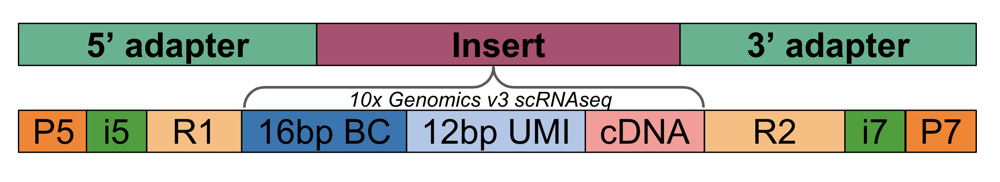

:::{important}
This page is a work in progress. Expect regular updates.
:::

# A primer on sequencing

Sequencing machines produce sequencing reads from library molecules. Library preparation kits provided by sequencing companies are used to generate sequence ready libraryes. Library molecules are structure as 5' -> 3' sets of "blocks" with the 5' and 3' end containing sequencing-machine specific adapters and the "insert" containing a custom assay-specific insert designed by the user. The following example shows the adapter-insert-adapter construct with the "insert" corresponding to a library generated with the 10xv3 single-cell RNA-seq assay.

## Illumina

### Sequencing by synthesis

Illumina sequencing by synthesis uses blocking dNTP incorporation and flourescence to image and then construct nucleotide sequence across hundreds of millions of sequences.

### Strandedness

Illumina sequencing begins at the sequencing primers and continues for a set number of cycles. Sequencing reads can be generated off of the top or bottom strand. For a library molecule with two sequencing primers, up to four reads can be generated; with one, only two can be generated. Importantly, the order and strandedness of read generation is dependent on both the sequencing machine and the sequencing kit used: https://support.illumina.com/content/dam/illumina-support/documents/documentation/system_documentation/miseq/indexed-sequencing-overview-guide-15057455-08.pdf

## Element Aviti

### Avidity sequencing

Paper describing avidity sequencing.
https://www.nature.com/articles/s41587-023-01750-7

Documentation on the Adept and Elevate library design.
https://go.elementbiosciences.com/elevate-and-adept-workflow-sequences-lt-00014

### Strandedness

## Pacific Biosciences

### Sequencing by zero-mode waveguides single-molecule detection of dNTP

I think this is the paper that describes this technology: https://www.pnas.org/doi/10.1073/pnas.1315735111

## Oxford Nanopore

### Sequencing by electrical signal detection across nano pores

Paper describing nanopore sequencing: https://www.nature.com/articles/nbt.1495

### Strandedness

Unlike Illumina, nanopore sequencing produces the direct nucleotide sequence in linear order starting at the beginning of the molecule. [But the read generated from a molecule can start from either end and either strand](https://nanoporetech.com/document/genomic-dna-by-ligation-sqk-lsk114). And the strand can be either the top or bottom strand. So a read is produced in one of four "orientations"

1. forward, top strand
2. forward, reverse strand
3. backward, top strand
4. backward, reverse strand
