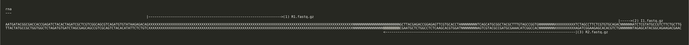

# Getting started

A `seqspec` file requires an understanding of multiple aspects of the sequencing library and FASTQ read structure, including:

- The library protocol used to generate your assay library (e.g., 10x Genomics v3)
- The library kit used to append sequencing primers to your library (e.g., Illumina Truseq dual index)
- The sequencing kit used to sequence your library (e.g., Illumina NovaSeq 6000 v1.5 kit)
- The sequencing machine used to sequence your library (e.g., Illumina NovaSeq 6000)
- The elements and nucleotide sequences of your sequencing library
  - For example, the first 10 bp are a primer, the next 16 are a barcode, etc.
- The sequencing reads generated from your sequencing protocol
  - Read 1 uses the read 1 primer
  - Index 1 uses the index 1 primer
  - etc.

**Note**: Developing a `seqspec` file for a published assay can be challenging, as authors often assume readers have prior knowledge or omit necessary information.

## Example: SPLiT-Seq Assay

Let's develop a `seqspec` for the [SPLiT-Seq assay](https://www.science.org/doi/10.1126/science.aam8999). We'll first gather the relevant information needed for the spec, determining both the library structure (the structure of the molecule placed on the sequencing machine) and the read structure (the elements contained within the FASTQ reads).

### Library structure

Figure 1A shows the library molecule structure, with the caption stating:

> Labeling transcriptomes with split-pool barcoding. In each split-pool round, fixed cells or nuclei are randomly distributed into wells, and transcripts are labeled with well-specific barcodes. Barcoded RT primers are used in the first round. Second- and third-round barcodes are appended to cDNA through ligation. A fourth barcode is added to cDNA molecules by PCR during sequencing library preparation. The bottom schematic shows the final barcoded cDNA molecule.

We need to extract and positionally index various pieces of the final barcoded molecule, including well-specific barcode sequences, primers, and biologically relevant features (cDNA). From Figure 1A, we have an idea of the structure:

```
P5/R1/cDNA/RT primer/1st BC/2nd BC/3rd BC/R2/4th BC/P7
```

The P5/P7 primers are Illumina-specific sequencing primers that bind the final molecule to the Illumina flow cell to fix the molecule's position for sequencing. R1/R2 are primers where sequencing by synthesis is initiated (either on the positive or negative strand). The RT primer binds to the cDNA in the first round of barcode synthesis for reverse transcription of the cDNA, using either a 15bp polyA stretch or random hexamer (6bp). The BCs are synthetic barcode sequences designed by the authors; we'll need to find the list of these barcodes.

To better understand each element of the final library, we'll go through the methods section:

> The first round of barcoding occurs through an in situ reverse transcription (RT) reaction. Cells are split into up to 48 wells, each containing barcoded well-specific reverse transcription primers. Both random hexamer and anchored poly(dT)15 barcoded RT primers were used in each well (Table S1).

This section tells us that the first round of barcoding uses an RT primer, which is either a random hexamer or a polyT sequence. This means the portion of cDNA being assayed will either come from the polyA tail or from somewhere random in the transcript. Importantly, we will need to source Table S1 as it contains the list of well-specific polyDT and random hexamer barcodes that tell us whether where the molecule came from (polyA or random). The manuscript says to look in Table S1 but that table contains metadata about the species-mixing experiments, it seems like the barcodes are actually in Table S12 and include barcode sequences in multiple sheets. The first sheet `General Oligonucleotides" contains the following information:

```tsv
Oligonucleotie Number	Description	Sequence
BC_0060	Round 3 barcode linker	AGTCGTACGCCGATGCGAAACATCGGCCAC
BC_0062	PCR primer, used after template switching (used with BC_0108)	CAGACGTGTGCTCTTCCGATCT
BC_0066	Round 3 blocking strand	GTGGCCGATGTTTCGCATCGGCGTACGACT
BC_0076	Nextera Tagmentation PCR primer (TSBC07), sublibrary index #1 (used with BC_0118)	CAAGCAGAAGACGGCATACGAGAT GATCTG GTGACTGGAGTTCAGACGTGTGCTCTTCCGATCT
BC_0077	Nextera Tagmentation PCR primer (TSBC08), sublibrary index #2 (used with BC_0118)	CAAGCAGAAGACGGCATACGAGAT TCAAGT GTGACTGGAGTTCAGACGTGTGCTCTTCCGATCT
BC_0078	Nextera Tagmentation PCR primer (TSBC09), sublibrary index #3 (used with BC_0118)	CAAGCAGAAGACGGCATACGAGAT CTGATC GTGACTGGAGTTCAGACGTGTGCTCTTCCGATCT
BC_0079	Nextera Tagmentation PCR primer (TSBC10), sublibrary index #4 (used with BC_0118)	CAAGCAGAAGACGGCATACGAGAT AAGCTA GTGACTGGAGTTCAGACGTGTGCTCTTCCGATCT
BC_0080	Nextera Tagmentation PCR primer (TSBC11), sublibrary index #5 (used with BC_0118)	CAAGCAGAAGACGGCATACGAGAT GTAGCC GTGACTGGAGTTCAGACGTGTGCTCTTCCGATCT
BC_0081	Nextera Tagmentation PCR primer (TSBC12), sublibrary index #6 (used with BC_0118)	CAAGCAGAAGACGGCATACGAGAT TACAAG GTGACTGGAGTTCAGACGTGTGCTCTTCCGATCT
BC_0082	Nextera Tagmentation PCR primer (TSBC13), sublibrary index #7 (used with BC_0118)	CAAGCAGAAGACGGCATACGAGAT TTGACT GTGACTGGAGTTCAGACGTGTGCTCTTCCGATCT
BC_0083	Nextera Tagmentation PCR primer (TSBC14), sublibrary index #8 (used with BC_0118)	CAAGCAGAAGACGGCATACGAGAT GGAACT GTGACTGGAGTTCAGACGTGTGCTCTTCCGATCT
BC_0108	PCR primer, used after template switching (used with BC_0062)	AAGCAGTGGTATCAACGCAGAGT
BC_0118	Nextera Tagmentation PCR primer N501 (used with BC_0076 through BC_0083)	AATGATACGGCGACCACCGAGATCTACAC TAGATCGC TCGTCGGCAGCGTCAGATGTGTATAAGAGACAG
BC_0127	Template switching primer, HPLC purified (purchased from Exiqon)	AAGCAGTGGTATCAACGCAGAGTGAATrGrG+G
BC_0215	Round 2 barcode linker	CGAATGCTCTGGCCTCTCAAGCACGTGGAT
BC_0216	Round 2 blocking strand	ATCCACGTGCTTGAGAGGCCAGAGCATTCG
```

The round 1 RT and round 2/3 ligation barcodes are in the remaining three sheets. Because they are quite long, I've included them in examples/specs/SPLiT-Seq. Below are the first 10 round 1 RT barcodes and round 2/3 ligation barcodes (note I've put spaces between the relevant regions):

```tsv
# Round 1 RT Barcodes
WellPosition	Primer Type	Name	Sequence
A1	dt(15)VN	Round1_01	/5Phos/AGGCCAGAGCATTCG AACGTGAT TTTTTTTTTTTTTTTVN
A2	dt(15)VN	Round1_02	/5Phos/AGGCCAGAGCATTCG AAACATCG TTTTTTTTTTTTTTTVN
A3	dt(15)VN	Round1_03	/5Phos/AGGCCAGAGCATTCG ATGCCTAA TTTTTTTTTTTTTTTVN
A4	dt(15)VN	Round1_04	/5Phos/AGGCCAGAGCATTCG AGTGGTCA TTTTTTTTTTTTTTTVN
A5	dt(15)VN	Round1_05	/5Phos/AGGCCAGAGCATTCG ACCACTGT TTTTTTTTTTTTTTTVN
A6	dt(15)VN	Round1_06	/5Phos/AGGCCAGAGCATTCG ACATTGGC TTTTTTTTTTTTTTTVN
A7	dt(15)VN	Round1_07	/5Phos/AGGCCAGAGCATTCG CAGATCTG TTTTTTTTTTTTTTTVN
A8	dt(15)VN	Round1_08	/5Phos/AGGCCAGAGCATTCG CATCAAGT TTTTTTTTTTTTTTTVN
A9	dt(15)VN	Round1_09	/5Phos/AGGCCAGAGCATTCG CGCTGATC TTTTTTTTTTTTTTTVN
A10	dt(15)VN	Round1_10	/5Phos/AGGCCAGAGCATTCG ACAAGCTA TTTTTTTTTTTTTTTVN
...

# Round 2 Ligation Barcodes
WellPosition	Name	Sequence
A1	Round2_01	/5Phos/CATCGGCGTACGACT AACGTGAT ATCCACGTGCTTGAG
A2	Round2_02	/5Phos/CATCGGCGTACGACT AAACATCG ATCCACGTGCTTGAG
A3	Round2_03	/5Phos/CATCGGCGTACGACT ATGCCTAA ATCCACGTGCTTGAG
A4	Round2_04	/5Phos/CATCGGCGTACGACT AGTGGTCA ATCCACGTGCTTGAG
A5	Round2_05	/5Phos/CATCGGCGTACGACT ACCACTGT ATCCACGTGCTTGAG
A6	Round2_06	/5Phos/CATCGGCGTACGACT ACATTGGC ATCCACGTGCTTGAG
A7	Round2_07	/5Phos/CATCGGCGTACGACT CAGATCTG ATCCACGTGCTTGAG
A8	Round2_08	/5Phos/CATCGGCGTACGACT CATCAAGT ATCCACGTGCTTGAG
A9	Round2_09	/5Phos/CATCGGCGTACGACT CGCTGATC ATCCACGTGCTTGAG
A10	Round2_10	/5Phos/CATCGGCGTACGACT ACAAGCTA ATCCACGTGCTTGAG
...

# Round 3 Ligation barcodes
WellPosition	Name	Sequence
A1	Round3_01	/5Biosg/CAGACGTGTGCTCTTCCGATCT NNNNNNNNNN AACGTGAT GTGGCCGATGTTTCG
A2	Round3_02	/5Biosg/CAGACGTGTGCTCTTCCGATCT NNNNNNNNNN AAACATCG GTGGCCGATGTTTCG
A3	Round3_03	/5Biosg/CAGACGTGTGCTCTTCCGATCT NNNNNNNNNN ATGCCTAA GTGGCCGATGTTTCG
A4	Round3_04	/5Biosg/CAGACGTGTGCTCTTCCGATCT NNNNNNNNNN AGTGGTCA GTGGCCGATGTTTCG
A5	Round3_05	/5Biosg/CAGACGTGTGCTCTTCCGATCT NNNNNNNNNN ACCACTGT GTGGCCGATGTTTCG
A6	Round3_06	/5Biosg/CAGACGTGTGCTCTTCCGATCT NNNNNNNNNN ACATTGGC GTGGCCGATGTTTCG
A7	Round3_07	/5Biosg/CAGACGTGTGCTCTTCCGATCT NNNNNNNNNN CAGATCTG GTGGCCGATGTTTCG
A8	Round3_08	/5Biosg/CAGACGTGTGCTCTTCCGATCT NNNNNNNNNN CATCAAGT GTGGCCGATGTTTCG
A9	Round3_09	/5Biosg/CAGACGTGTGCTCTTCCGATCT NNNNNNNNNN CGCTGATC GTGGCCGATGTTTCG
A10	Round3_10	/5Biosg/CAGACGTGTGCTCTTCCGATCT NNNNNNNNNN ACAAGCTA GTGGCCGATGTTTCG
```

Note that the barcodes are 8bp long.

The methods describe how the final library is constructed from these various pieces:

> The second and third barcoding round consist of a ligation reaction. Each round uses a different set of 96 well barcoding plates (Table S1). Ligation rounds have a universal linker strand with partial complementarity to a second strand containing the unique wellspecific barcode sequence added to each well. These strands were annealed together prior to cellular barcoding to create a DNA molecule with three distinct functional domains: a 5’ overhang that is complementary to the 3’ overhang present on the cDNA molecule (may originate from RT primer or previous barcoding round), a unique well-specific barcode sequence, and a 3’ overhang complementary to the 5’ overhang present on the DNA molecule to be subsequently ligated (Fig. S1A). For the third round barcodes, the 5’ overhang also contains a unique molecular identifier (UMI), a universal PCR handle, and a biotin molecule.

This tells us that between any two barcodes there is a constant linker sequence that we need to include in our specification. These linker sequences are the combination of two adjacent linker sequences between barcodes. To understand the structure of these linker sequences we start by going through the step where the round 2 barcode is added to round 1 barcode. The round 1 barcode grabbed the cDNA by the poly T (or random hexamer) and we use it as the starting substrate to add the round 2 barcode.

```
# round 1 molecule bound to cDNA
5' - /cDNA/poly A/ - 3'
     3' - /poly T/rev BC 1/rev link 1/5Phos/ - 5'

+

# round 2 molecule bound to ligation adapter (combination of rev link 1 and rev link 2A)
5' - /rev link 1/rev link 2A/ - 3'
           5' - /rev link 2A/rev BC 2/rev link 2b/ - 3'

=

# intermediary product with cDNA, round 1, and round 2 barcodes
5' - /cDNA/poly A/         /rev link 1/rev link 2A/ - 3'
     3' - /poly T/rev BC 1/rev link 1/rev link 2A/rev BC 2/rev link 2b/ - 3'
```

So in the 5' to 3' direction, the linker is the reverse of the first linker followed by the reverse of the second "A" linker. Here is an example for round 1/round 2 linkers:

```
Round 1 A1	dt(15)VN	Round1_01	/5Phos/AGGCCAGAGCATTCG AACGTGAT TTTTTTTTTTTTTTTVN
Round 2 A1	Round2_01	/5Phos/CATCGGCGTACGACT AACGTGAT ATCCACGTGCTTGAG

link 1  : 3' - AGGCCAGAGCATTCG - 5' (rev GCTTACGAGACCGGA)
link 2A : 3' - ATCCACGTGCTTGAG - 5' (rev GAGTTCGTGCACCTA)
-> linker 1: 5' - GCTTACGAGACCGGAGAGTTCGTGCACCTA - 3'
```

Linker 2 can be found similarly:

```
Round 2 A1	Round2_01	/5Phos/CATCGGCGTACGACT AACGTGAT ATCCACGTGCTTGAG
Round 3 A1	Round3_01	/5Biosg/CAGACGTGTGCTCTTCCGATCT NNNNNNNNNN AACGTGAT GTGGCCGATGTTTCG

link 2B:
3' - CATCGGCGTACGACT - 5' (5' - TCAGCATGCGGCTAC - 3')

link 3A:
3' - GTGGCCGATGTTTCG - 5' (5' - GCTTTGTAGCCGGTG - 3')

-> linker 2:
5' - TCAGCATGCGGCTACGCTTTGTAGCCGGTG - 3'
```

And linker 3 is just part of the R2 primer (used to attach the full R2 primer): `TCTAGCCTTCTCGTGTGCAGAC`. Note that we can also tell from the structure of the barcodes that the third round barcode includes a 10 UMI (NNNNNNNNNN) which was not denoted in Figure 1A. We will update our expectation for the structure of the sequenced molecule in addition to including the changes to the sequence order of the barcodes:

```
P5/R1/cDNA/RT primer/8bp 1st BC (rev, bottom strand)/linker 1 (GCTTACGAGACCGGAGAGTTCGTGCACCTA)/8bp 2nd BC (rev, botton strand)/linker 2 (TCAGCATGCGGCTACGCTTTGTAGCCGGTG)/8bp 3rd BC (rev, bottom strand)/10bp UMI/R2/4th BC (rev, bottom strand)/P7
```

We now need to find out what the R1/R2, P5/P7 sequences are as well as the mysterious 4th barcode. The methods describe the following:

> For tagmentation, a Nextera XT Library Prep Kit was used (Illumina).

This shows the authors used is an Illumina kit used for library preparation. The P7 primer is used with specific barcodes (listed in the first sheet of Table S12) we reproduce them below:

```
Nextera Tagmentation PCR primer: CAAGCAGAAGACGGCATACGAGAT [6bp barcode] GTGACTGGAGTTCAGACGTGTGCTCTTCCGATCT

# Where the 6bp barcode comes from one of the following:
BC_0076 (TSBC07), sublibrary index #1 GATCTG
BC_0077 (TSBC08), sublibrary index #2 TCAAGT
BC_0078 (TSBC09), sublibrary index #3 CTGATC
BC_0079 (TSBC10), sublibrary index #4 AAGCTA
BC_0080 (TSBC11), sublibrary index #5 GTAGCC
BC_0081 (TSBC12), sublibrary index #6 TACAAG
BC_0082 (TSBC13), sublibrary index #7 TTGACT
BC_0083 (TSBC14), sublibrary index #8 GGAACT
```

> In this order, a 15 μL volume of Nextera PCR mix, 8 μL of water, and 1 μL of each primer (P5 primer: BC_0118, one indexed P7 primer: BC_0076-BC_0083) at a stock concentration of 10 μM was added to the mix, making a total volume of 50 μL. Using distinct, indexed PCR primers, this PCR reaction can be used to add a unique barcode to each sublibrary barcoded.

During this process, the P5 and P7 primers are added to the dna library. Nextera Tagmentation is used to attach an adapter to the DNA library molecule and further ligation is used to attach the P5 primer to the base molecule (`AATGATACGGCGACCACCGAGATCTACAC TAGATCGC TCGTCGGCAGCGTCAGATGTGTATAAGAGACAG`). The P7 is a primer gets paired with a unique barcode sequence to create "sublibraries" and is attached by ligation with the Read 2 primer. This unique P7 barcode is what the authors are referring to as the 4th barcode. The P7 primer is therefore `TAGAGCATACGGCAGAAGACGAAC`, the reverse of the sequence used.

The strand that the library is constructed from dictates the strandedness of the sequences that we put in the `seqspec` file. Since the library was built in the 3' -> 5' direction, we have to ensure we reverse complement the bases where appropriate. The final library structure is therefore:

```
P5 (fixed, AATGATACGGCGACCACCGAGATCTACAC)
Spacer (fixed, TAGATCGC)
R1 (fixed, TCGTCGGCAGCGTCAGATGTGTATAAGAGACAG)
cDNA (random, variable length)
RT primer (fixed, either random hexamer, NNNNNN, or (poly A)15, AAAAAAAAAAAAAAA)
8bp 1st BC (rev, bottom strand, from Round 1 BC list, 8bp)
linker 1 (fixed, GCTTACGAGACCGGAGAGTTCGTGCACCTA)
8bp 2nd BC (rev, botton strand, from Round 2 BC list, 8bp)
linker 2 (TCAGCATGCGGCTACGCTTTGTAGCCGGTG)
8bp 3rd BC (rev, bottom strand, from Round 3 BC list, 8bp)
10bp UMI (random, 10 bp)
R2 (fixed, TCTAGCCTTCTCGTGTGCAGAC)
4th BC (rev, bottom strand, from Index BC list, 6bp)
P7 (ATCTCGTATGCCGTCTTCTGCTTG)
```

### Determining the Read structure

> Libraries were sequenced on MiSeq or NextSeq systems (Illumina) using 150 nucleotide (nt) kits and paired-end sequencing. Read 1 (66 nt) covered the transcript sequences. Read 2 (94 nt) covered the UMI and UBC barcode combinations. The index read (6 nt), serving as the fourth barcode, covered the sublibrary indices introduced after tagmentation.

A useful resource of the order and strandedness of various sequencing libraries/protocols is https://pachterlab.github.io/seqspec/reads.html. The sequencing kit and sequencer dictates the order and strandedness of the sequencing reads. Illumina libraries that use the single-index workflow do not differ; only those which use the dual index workflow. Three reads are generated

1. Read 1: uses the Read 1 primer, sequences 5' -> 3' on the top strand into the insert. In the case of this assay, Read 1 is 66bp.
2. Index 1: uses the Read 2 primer, sequences 5' -> 3' on the top strand into the insert. Ibn the case of this assay, Index 1 is 6bp.
3. Read 2: uses the Read 2 primer, sequences the 5' -> 3' on the bottom strand into the insert. In the case of this assay Read 2 is 94 bp.

## Summary

From the manuscript we have extracted the following information about the library structure and the read structure:

### Library structure

- rna assay
  - P5
    - Sequence type: fixed
    - Sequence: AATGATACGGCGACCACCGAGATCTACAC
    - Min. len: 29
    - Max. len: 29
  - Spacer
    - Sequence type: fixed
    - Sequence: TAGATCGC
    - Min. len: 8
    - Max. len: 8
  - Read 1 primer
    - Sequence type: fixed
    - Sequence: TCGTCGGCAGCGTCAGATGTGTATAAGAGACAG
    - Min. len: 33
    - Max. len: 33
  - cDNA
    - Sequence type: random
    - Sequence: X
    - Min. len: 1
    - Max. len: 1098
  - RT primer
    - Sequence type: Onlist
    - Sequence: NNNNNN, or (poly A)15, AAAAAAAAAAAAAAA
    - Min. len: 6
    - Max. len: 15
  - Round 1 BC (note: rev, bottom strand)
    - Sequence type: onlist (from onlist_round1.txt)
    - Sequence: NNNNNNNN
    - Min. len: 8
    - Max. len: 8
  - linker 1
    - Sequence type: fixed
    - Sequence: GCTTACGAGACCGGAGAGTTCGTGCACCTA
    - Min. len: 30
    - Max. len: 30
  - Round 2 BC (note: rev, botton strand)
    - Sequence type: onlist (from onlist_round2.txt)
    - Sequence: NNNNNNNN
    - Min. len: 8
    - Max. len: 8
  - Linker 2
    - Sequence type: fixed
    - Sequence: TCAGCATGCGGCTACGCTTTGTAGCCGGTG
    - Min. len: 30
    - Max. len: 30
  - Round 3 BC (note: rev, botton strand)
    - Sequence type: onlist (from onlist_round3.txt)
    - Sequence: NNNNNNNN
    - Min. len: 8
    - Max. len: 8
  - UMI
    - Sequence type: random
    - Sequence: NNNNNNNNNN
    - Min. len: 10
    - Max. len: 10
  - Read 2 primer
    - Sequence type: fixed
    - Sequence: TCTAGCCTTCTCGTGTGCAGAC
    - Min. len: 22
    - Max. len: 22
  - Round 4 BC (note: rev, botton strand)
    - Sequence type: onlist (from onlist_round4.txt)
    - Sequence: NNNNNN
    - Min. len: 6
    - Max. len: 6
  - P7
    - Sequence type: fixed
    - Sequence: ATCTCGTATGCCGTCTTCTGCTTG
    - Min. len: 24
    - Max. len: 24

**Note**: The significance of the barcodes being reverse and on the bottom strand (relative to the list of barcodes in Table S12) is that we must reverse complement the barcodes so that the seqspec represents the elements of the library 5' -> 3' on the top strand.

### Sequence structure

- Read 1
  - Modality: rna
  - Primer ID: Read 1 primer
  - Strand: pos
  - Min. len: 66
  - Max. len: 66
- Index 1
  - Modality: rna
  - Primer ID: Read 2 primer
  - Strand: pos
  - Min. len: 6
  - Max. len: 6
- Read 2
  - Modality: rna
  - Primer ID: Read 2 primer
  - Strand: neg
  - Min. len: 94
  - Max. len: 94

This information is sufficient to build the `seqspec`.

## Initializing the spec

To help users create a seqspec from their own data, the `seqspec` cli offers a simple tool `seqspec init` that autogenerates an initial `spec.yaml` from a string representation of the data. The spec is incomplete and requires additional information and checks to be a fully valid spec. The seqspec input is a [newick file format](https://en.wikipedia.org/wiki/Newick_format) which naturally represents nested grouping of sequencing files and sequenced elements. Following our example from before we have the following library structure:

And the following read structure:

A compatible `newick` string would be (note we have to remove whitespace from the element names)

```bash
((P5:29,Spacer:8,Read_1_primer:33,cDNA:1098,RT_primer:15,Round_1_BC:8,linker_1:30,Round_2_BC:8,Linker_2:30,Round_3_BC:8,UMI:10,Read_2_primer:22,Round_4_BC:6,P7:24)rna)
```

Breaking the string we see the nested structure of the data

```bash
(
  (
    P5:29,
    Spacer:8,
    Read_1_primer:33,
    cDNA:1098,
    RT_primer:15,
    Round_1_BC:8,
    linker_1:30,
    Round_2_BC:8,
    Linker_2:30,
    Round_3_BC:8,
    UMI:10,
    Read_2_primer:22,
    Round_4_BC:6,
    P7:24
  )rna
)
```

Initializing a `seqspec` specification is as simple as

```bash
seqspec init -n SPLiTSeq -m 1 -o spec.yaml "((P5:29,Spacer:8,Read_1_primer:33,cDNA:1098,RT_primer:15,Round_1_BC:8,linker_1:30,Round_2_BC:8,Linker_2:30,Round_3_BC:8,UMI:10,Read_2_primer:22,Round_4_BC:6,P7:24)rna)"
```

Note that the newick string must be enclosed in quotes.

## Populate the spec

Next, add relevant information to the spec by hand. We will need to populate the header, the sequence_spec and the library_spec with relevant information.

### Updating the header

```yaml
!Assay
seqspec_version: 0.2.0
assay_id: SPLiTSeq
name: SPLiTSeq
doi: https://doi.org/10.1126/science.aam8999
date: 15 March 2018
description: split-pool ligation-based transcriptome sequencing
modalities:
  - rna
lib_struct: https://teichlab.github.io/scg_lib_structs/methods_html/SPLiT-seq.html
sequence_protocol: NextSeq 500
sequence_kit: NextSeq 550 reagents
library_protocol: SPLiTSeq RNA
library_kit: Custom/Nextera/Truseq Single Index
sequence_spec: []
library_spec:
```

### Updating the `sequence_spec`

The `sequence_spec` stores information about the sequencing reads that are generated from the sequencing procedure. We have alread identified the relevant information the various reads. We need to populate a list of `Read` objects in the `seqspec`:

```yaml
- !Read
  read_id:
  name:
  modality:
  primer_id:
  min_len:
  max_len:
  strand:
```

We have generated three reads when sequencing this assay, so we have the following three reads that we add to the `sequence_spec` (using the information we identified earlier):

```yaml
sequence_spec:
  - !Read
    read_id: R1.fastq.gz
    name: Read 1
    modality: rna
    primer_id: Read_1_primer
    min_len: 66
    max_len: 66
    strand: pos
  - !Read
    read_id: I1.fastq.gz
    name: Index 1 (i7 index)
    modality: rna
    primer_id: Read_2_primer
    min_len: 6
    max_len: 6
    strand: pos
  - !Read
    read_id: R2.fastq.gz
    name: Read 2
    modality: rna
    primer_id: Read_2_primer
    min_len: 94
    max_len: 94
    strand: neg
```

**Important**: ensure that the `primer_id` maps to the correct `region_id` off of which the sequencing read is generated (in the `library_spec`).

### Updating the `library_spec`

We now need to augment the elements of our `library_spec`. We will fill in the following information for each element:

```yaml
- !Region
  parent_id: null
  region_id:
  region_type:
  name:
  sequence_type:
  sequence:
  min_len:
  max_len:
  onlist:
    location:
    filename:
    md5:
  regions: null
```

Let's start with one of the barcode elements (the rest are the same):

```yaml
- !Region
  parent_id: null
  region_id: Round_1_BC
  region_type: barcode
  name: Round_1_BC
  sequence_type: onlist
  sequence: NNNNNNNN
  min_len: 8
  max_len: 8
  onlist: !Onlist
    location: local
    filename: onlist_round1.txt
    md5: 076f32ce8a96038bfc0c618da2204c77
  regions: null
```

Note that we put the specific 8bp barcode sequences in their own file (one sequence per line).

The other regions follow similarly:

```yaml
- !Region
  parent_id: null
  region_id: linker_1
  region_type: linker
  name: linker_1
  sequence_type: fixed
  sequence: GCTTACGAGACCGGAGAGTTCGTGCACCTA
  min_len: 30
  max_len: 30
  onlist: null
  regions: null
```

Once you've populated all of the metadata for the various regions we can move onto formatting the spec and checking the correctness of it.

## Format and check the spec

Update the `seqspec` file with `seqspec format`:

```bash
seqspec format -o fmt.yaml spec.yaml
```

And lastly, check that the spec is properly formatted and manually correct errors as needed:

```bash
seqspec check fmt.yaml
```

We recommend depositing 1 million FASTQ records from for the FASTQ files pointed to by the spec. This can be generated by running the following:

```bash
# fastq files has 4 lines per record so 1 million records = 4 million lines
zcat allreads_R1.fastq.gz | head -4000000 | gzip > R1.fastq.gz
```

## View the spec

To view the "ordered tree" representation of the `library_spec`, run

```bash
seqspec print fmt.yaml
```

which prints

```bash
                                          ┌─'P5:29'
                                          ├─'Spacer:8'
                                          ├─'Read_1_primer:33'
                                          ├─'cDNA:1098'
                                          ├─'RT_primer:15'
                                          ├─'Round_1_BC:8'
                                          ├─'linker_1:30'
──────────────────── ──rna────────────────┤
                                          ├─'Round_2_BC:8'
                                          ├─'Linker_2:30'
                                          ├─'Round_3_BC:8'
                                          ├─'UMI:10'
                                          ├─'Read_2_primer:22'
                                          ├─'Round_4_BC:6'
                                          └─'P7:24'
```

`seqspec print` also allows users to layer on the `sequence_spec` onto the `library_spec`. This can be helpful for debugging your spec.

```
seqspec print -s libseq -f sequence spec.yaml
```



# A note on checking the correctness of the spec

The `seqspec` CLI comes with the capabilities to check the correctness of your `spec.yaml` against the formal specification. When running `seqspec check spec.yaml` you may find that your spec has numerous errors that will need to be corrected. `seqspec check spec.yaml` can be run again after fixing these errors to ensure that the spec fully conforms to the formal specification. Make sure to reformat your spec after correcting errors using `seqspec format`. For a list of errors, please see the [DOCUMENTATION.md](DOCUMENTATION.md)
